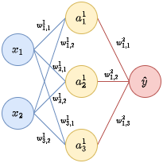

# CUDA Neural Network (C++) 
## Overview
This document details the architecture, forward propagation, and back propagation of a basic Multilayer Perceptron (MLP) that is implemented in CUDA programming to solve the XOR problem.
## CUDA Programming
CUDA, characterized by its high throughput and high latency, is an effective programming platform for performing large matrix multiplication via techniques like memory coalescing and tiled dot product, speeding up computations and reducing memory consumption.

The following is an example of the kernel preforming tiled matrix multiplication in the linear layer (```src/layers/linear_layer.cu```).
```cpp
__global__ void linearLayerComputeOutput(const float* __restrict__ W, const float* __restrict__ A, float* __restrict__ Z, 
                                          const float* __restrict__ b, int W_x, int W_y, int A_x, int A_y){

	__shared__ float tileW[16][16];
	__shared__ float tileA[16][16];

	const int row= blockIdx.y * blockDim.y + threadIdx.y;
	const int col= blockIdx.x * blockDim.x + threadIdx.x;

	const int tx = threadIdx.x;
	const int ty = threadIdx.y;

	const int Z_x= A_x;
	const int Z_y= W_y;

	float element_value= 0.0f;

	for (int i= 0; i < ((W_x + blockDim.x -1) / blockDim.x); i++) {
		if (tx + i*blockDim.x < W_x && row < W_y){
			tileW[ty][tx] = W[row*W_x + i*blockDim.x + tx];
		}
		else{
			tileW[ty][tx]= 0.0f;
		}

		if (ty + i*blockDim.x < A_y && col < A_x){
			tileA[ty][tx] = A[(ty + i * blockDim.x) * A_x + col];
		}
		else{
			tileA[ty][tx]= 0.0f;
		}
		
		__syncthreads();

		#pragma unroll
		for (int k = 0; k < blockDim.x; k++) {
			element_value += tileW[ty][k] * tileA[k][tx];
		}

		__syncthreads();
	}

	if (row < Z_y && col < Z_x) {
        Z[row * Z_x + col] = element_value + b[row];
    }
}
```

### Key terms:
- ```__global__```: Marks a function that runs on the GPU and is called from the CPU. CPU allocates and deallocates Data in GPU's "global" memory.

- ```__shared__```: Declares memory that is shared among threads in the same block on the GPU.
- ```__syncthreads```:  Acts as a barrier synchronization, causing threads in a block to wait until all have reached this point.
- ```__restricted__```: Informs the compiler that a pointer does not alias other pointers, potentially improving performance. 
- ```#param unroll```: Directs the compiler to unroll loops, potentially improving performance by converting loops into separate instructions.

>**__NOTE__** There is still a lot of room for improvement in all kernels and under construction. For more information on the above kernel refer to the CUDA programming guide [here](https://docs.nvidia.com/cuda/cuda-c-best-practices-guide/index.html#shared-memory-in-matrix-multiplication-c-ab__improvement-reading-additional-data-shared-memory).

## Architecture
### Input-layer: 
- $x \in \mathbb{R}^2$
### $L$ Hidden-layers:
- Linear Neurons:
    - $z^l =  W^{l}a^{l-1} + b^l$\
    where, $W^l \in \mathbb{R}^{j \times k}$, $a^{l-1} \in \mathbb{R}^k$, $b^l, z^l \in \mathbb{R}^j$
- Rectified Linear-Unit (ReLU) Activation Function:
    - $a^l= \max{\left(0, z^l\right)}$
- Sigmoid Activation Function:
    - $a^l=  (1 + e^{-z^l})^{-1} = \sigma(z^l)$
### Output-layer:
- $\hat{y} \in \mathbb{R}$
### Loss function:
- Binary Cross-Entropy (BCE):
  - $\mathcal{L}= \frac{1}{m}\sum_{i=1}^m \left(y_i \log(\hat{y}_i) + (1-y_i) + \log(1-\hat{y}_i)\right)$
> **__NOTE__** $a^0= x, a^L= \hat{y}$
## Forward Propagation
### Recursive General Form
$\text{For } l=1,\ldots,L$
$$a^l= \max\left(0,z^l:= W^{l}a^{l-1} + b^l \right)$$

### Example
For simplcity, consider the following neural network:

<p align="center">
  
</p>

The input, hidden, and output layers will have their size represented as $k,j,p$ respectively to ensure that the order matrix multiplication here is invariant to the architecture's width.

The input layer is composed of the two blue nodes
```math 
x = \begin{bmatrix}
x_1\\
x_2
\end{bmatrix}_{(k \times 1)}
```

The weights and baisis have the following noation:
-   $w^l_{j,k}$ where, $l$ represents the layer, $k$ reprsents the posterior neuron connection, $j$ represents the anterior neuron connection.  Each line corresponds to a single weight.
-   $b^l_j$ where $l$ is also the layer and $j$ is the neuron in the anterior layer.

Each linear layer has a weight matrix $W$ and bias vector $b$, for example the first layer has the following form:
```math
W^1= \begin{bmatrix}
w_{1,1}^1 & w_{1,2}^1\\
w_{2,1}^1 & w_{2,2}^1\\
w_{3,1}^1 & w_{3,2}^1
\end{bmatrix}_{(j\times k)}, b^l=  \begin{bmatrix}
b^1_1\\
b^1_2\\
b^1_3
\end{bmatrix}_{(j\times 1)}
```

The inputs are then pass through the first layer. Recall $a^l= \max\left(0,z^l:= W^{l}a^{l-1} + b^l \right)$.
```math
z^1= \begin{bmatrix}
w_{1,1}^1 & w_{1,2}^1\\
w_{2,1}^1 & w_{2,2}^1\\
w_{3,1}^1 & w_{3,2}^1
\end{bmatrix}
\begin{bmatrix}
x_1\\
x_2\\
\end{bmatrix}
+ \begin{bmatrix}
b^1_1\\
b^1_2\\
b^1_3
\end{bmatrix}
```
```math
a^1= \begin{bmatrix}
\max(0, w_{1,1}^1x_1+ w_{1,2}^1x_2 + b^1_1)\\
\max(0, w_{2,1}^1x_1+ w_{2,2}^1x_2 + b^1_2)\\
\max(0, w_{3,1}^1x_1+ w_{3,2}^1x_2 + b^1_3)
\end{bmatrix}= \begin{bmatrix}
\max(0, z^1_1)\\
\max(0, z^1_2)\\
\max(0, z^1_3)
\end{bmatrix}=\begin{bmatrix}
a^1_1\\
a^1_2\\
a^1_3
\end{bmatrix}_{(j\times 1)}
```
The output of the first layer has the following Jacobain:
```math
\Rightarrow \frac{\partial a^1}{\partial z^1} = \begin{bmatrix}
\frac{\partial a^1_1}{\partial z^1_1} && \frac{\partial a^1_1}{\partial z^1_2} && \frac{\partial a^1_3}{\partial z^1_3}\\
\frac{\partial a^1_2}{\partial z^1_1} && \frac{\partial a^1_2}{\partial z^1_2} && \frac{\partial a^1_3}{\partial z^1_3}\\
\frac{\partial a^1_3}{\partial z^1_1} && \frac{\partial a^1_3}{\partial z^1_2} && \frac{\partial a^1_3}{\partial z^1_3}
\end{bmatrix} = \begin{bmatrix}
\frac{\partial a^1_1}{\partial z^1_1} && 0 &&0 \\
0 && \frac{\partial a^1_2}{\partial z^1_2} && 0\\
0 && 0  && \frac{\partial a^1_3}{\partial z^1_3}
\end{bmatrix}_{(j\times j)}
```
The output of previous layer is passed as an input to the next layer:
```math
z^2= W^2a^1 + b^2=\begin{bmatrix}
w_{1,1}^2 & w_{1,2}^2 & w_{1,3}^2
\end{bmatrix}_{(p\times j)}
\begin{bmatrix}
a^1_1\\
a^1_2\\
a^1_3
\end{bmatrix}
+ \begin{bmatrix}
b^2_1
\end{bmatrix}_{(p\times 1)}
```
```math
a^2= \begin{bmatrix}
\sigma\left(0, w^2_{1,1}a^1_1+ w^2_{1,2}a^1_2+ w^2_{1,3}a^1_3 + b^2_1\right)
\end{bmatrix}= \begin{bmatrix}\sigma(0, z^2_1)\end{bmatrix}=\begin{bmatrix}a^2_1\end{bmatrix}_{(p\times 1)}
```
Jacobian for the output of the second layer:
```math
\Rightarrow \frac{\partial a^1}{\partial z^1} = \begin{bmatrix}\frac{\partial a^2_1}{\partial z^2_1}\end{bmatrix}_{(p\times p)}
```
>**__NOTE__** The Jacobians were calculated here to conserve space in the next section. In fact they are computed during back-propagation.
## Back Propagation
### Recursive General Form
Back propagation is used to recursively calculate the gradient of the loss function with respect to the weights and biases by moving backward through the network. This process involves passing the error term $\delta^l$ from one layer to the previous layer, using the input $a^l$, until the gradients reach the initial layer. These gradients are necessary for updating the network's parameters and enabling learning.\
$\text{For } l=L,\ldots,1$
$$\delta^{l-1}= \frac{\partial a^{l-1}}{\partial z^{l-1}}(W^l)^{\top}\delta^{l}$$
$\text{Where: } \delta^L= \frac{\partial a^L}{\partial z^L}\frac{\partial \mathcal{L}}{\partial a^L}$
#### Basic Gradient Descent Optimization:
```math
b^l_{new}= b^l_{old}- \eta\frac{\partial \mathcal{L}}{\partial b^l} \text{, \;\;} \frac{\partial \mathcal{L}}{\partial b^l}=  \delta^l
```
```math
W^l_{new}= W^l_{old}- \eta\frac{\partial \mathcal{L}}{\partial W^l} \text{, \;\;} \frac{\partial \mathcal{L}}{\partial W^l}=  \delta^l(a^{l-1})^\top
```
$\text{Where: } \eta := \text{diag}(\eta, \ldots, \eta)$

### Example
Recall this neural network:
<p align="center">
  
</p>

For demonstration purposes, assume MSE loss. The loss function will reconstructed so its gradient can be broken into intermediate terms: 
```math
\mathcal{L}= \frac{1}{2m}\sum_{i=1}^{m}\left(y_i-a^L_i\right)^2
```
```math
\mathcal{L}=  \frac{1}{2m}\sum_{i=1}^{m}\left(v\right)^2, \text{ where } v=y_i-a^L_i
```

The first error term ($\delta^{L=2}$) is initialized:
```math
\delta^2= \frac{\partial a^2}{\partial z^2} \frac{\partial v}{\partial a^2} \frac{\partial \mathcal{L}}{\partial v}= \frac{\partial \mathcal{L}}{\partial z^2}
```
Second Layer: The gradients are calculated and used in optimization:
```math
\frac{\partial \mathcal{L}}{\partial b^2}=\frac{\partial \mathcal{L}}{\partial z^2}\frac{\partial z^2}{\partial b^2}=  \delta^2
```
```math
\frac{\partial \mathcal{L}}{\partial W^2}= \frac{\partial \mathcal{L}}{\partial z^2}\frac{\partial z^2}{\partial W^2}=  \delta^2(a^{2-1})^\top
```
```math
\Longrightarrow \delta^2= \frac{\partial a^2}{\partial z^2} \cdot \frac{1}{m}\sum_{i=1}^{m}\left(y_i-a^L_i\right) = \begin{bmatrix}\frac{\partial a^2_1}{\partial z^2_1}\end{bmatrix}_{(p\times p)}
\begin{bmatrix}
\frac{1}{m}(e_1 + \ldots + e_m)
\end{bmatrix}_{(p\times 1)}= \begin{bmatrix}
\delta^2_1
\end{bmatrix}_{(p\times 1)}
```
```math
\Longrightarrow \frac{\partial \mathcal{L}}{\partial b^2}=\begin{bmatrix}
\delta^2_1
\end{bmatrix}
```
```math
b^2_{new}= b^2_{old}- \eta\frac{\partial \mathcal{L}}{\partial b^2}= \begin{bmatrix}
b^2_1
\end{bmatrix}- \begin{bmatrix}
\eta
\end{bmatrix}
\begin{bmatrix}
\delta^{2}_1
\end{bmatrix}
```
```math
\Longrightarrow \frac{\partial \mathcal{L}}{\partial W^2} =\begin{bmatrix}
\delta^2_1
\end{bmatrix}_{(p\times 1)}
\begin{bmatrix}
a^1_1 & a^1_2 & a^1_3
\end{bmatrix}_{(1\times j)}= \begin{bmatrix} dw_{1,1}^2 & dw_{1,2}^2 & dw_{1,3}^2 \end{bmatrix}_{(p\times j)}
```
```math
W^2_{new} = W^2_{old} - \eta\frac{\partial \mathcal{L}}{\partial W^{2}} =
\begin{bmatrix}
w_{1,1}^2 & w_{1,2}^2 & w_{1,3}^2
\end{bmatrix} 
-
\begin{bmatrix}
\eta
\end{bmatrix}
\begin{bmatrix} dw_{1,1}^2 & dw_{1,2}^2 & dw_{1,3}^2 \end{bmatrix}
```
First layer: The gradients are calculated and used in optimization:
```math
\delta^{1}= \frac{\partial a^{1}}{\partial z^{1}}\frac{\partial z^2}{\partial a^{1}}\frac{\partial a^2}{\partial z^2} \frac{\partial v}{\partial a^2} \frac{\partial \mathcal{L}}{\partial v}=\frac{\partial \mathcal{L}}{\partial z^{1}}
```
```math
\frac{\partial \mathcal{L}}{\partial b^{1}}= \frac{\partial \mathcal{L}}{\partial z^{1}}\frac{\partial z^{1}}{\partial b^{1}}=  \delta^{1}
```
```math
\frac{\partial \mathcal{L}}{\partial W^{1}}= \frac{\partial \mathcal{L}}{\partial z^{1}}\frac{\partial z^{1}}{\partial W^{1}}=  \delta^{1}(a^{0})^\top
```
```math
\Longrightarrow \delta^{1}= \frac{\partial a^{1}}{\partial z^{1}}(W^2)^{\top}\delta^{2} = \begin{bmatrix}
\frac{\partial a^1_1}{\partial z^1_1} && 0 &&0 \\
0 && \frac{\partial a^1_2}{\partial z^1_2} && 0\\
0 && 0  && \frac{\partial a^1_3}{\partial z^1_3}
\end{bmatrix}_{(j\times j)}
\begin{bmatrix}
w_{1,1}^2 \\
w_{1,2}^2 \\
w_{1,3}^2
\end{bmatrix}_{(j\times p)}
\begin{bmatrix}
\delta^2_1
\end{bmatrix}_{(p\times 1)}= \begin{bmatrix}
\delta^{1}_1\\
\delta^{1}_2\\
\delta^{1}_3
\end{bmatrix}_{(j\times 1)}
```
```math
\Longrightarrow \frac{\partial \mathcal{L}}{\partial b^{1}} = \begin{bmatrix}
\delta^{1}_1\\
\delta^{1}_2\\
\delta^{1}_3
\end{bmatrix}
```
```math
b^1_{new}= b^1_{old}- \eta\frac{\partial \mathcal{L}}{\partial b^1}= \begin{bmatrix}
b^1_1\\
b^1_2\\
b^1_3
\end{bmatrix}- \begin{bmatrix}
\eta& 0 & 0\\
0 & \eta & 0\\
0 & 0 & \eta
\end{bmatrix}
\begin{bmatrix}
\delta^{1}_1\\
\delta^{1}_2\\
\delta^{1}_3
\end{bmatrix}
```
```math
\Longrightarrow \frac{\partial \mathcal{L}}{\partial W^{1}} = \begin{bmatrix}
\delta^{1}_1\\
\delta^{1}_2\\
\delta^{1}_3
\end{bmatrix}_{(j\times 1)}\begin{bmatrix}
x_1 & x_2
\end{bmatrix}_{(1\times k)}= \begin{bmatrix}
dw_{1,1}^1 & dw_{1,2}^1\\
dw_{2,1}^1 & dw_{2,2}^1\\
dw_{3,1}^1 & dw_{3,2}^1
\end{bmatrix}_{(j\times k)}
```
```math
W^1_{new} = W^1_{old} - \eta\frac{\partial \mathcal{L}}{\partial W^{1}} =
\begin{bmatrix}
w_{1,1}^1 & w_{1,2}^1\\
w_{2,1}^1 & w_{2,2}^1\\
w_{3,1}^1 & w_{3,2}^1
\end{bmatrix}
-
\begin{bmatrix}
\eta& 0 & 0\\
0 & \eta & 0\\
0 & 0 & \eta
\end{bmatrix}
\begin{bmatrix}
dw_{1,1}^1 & dw_{1,2}^1\\
dw_{2,1}^1 & dw_{2,2}^1\\
dw_{3,1}^1 & dw_{3,2}^1
\end{bmatrix}
```
Note that $\delta^2$ is naturally derived as part of the calculation for $\delta^1$, illustrating how each error term is interconnected through the input of the previous layer, akin to a nested function. This is why the algorithm is often given the misnomer of chain rule. If the same pattern of indices continue, one can also assume that the order of multiplication is also invariant to depth.
